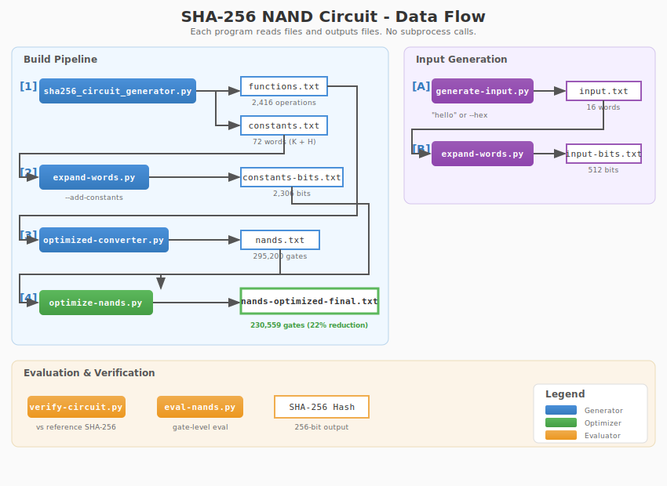

# SHA-256 NAND Circuit

A complete implementation of SHA-256 as a circuit of NAND gates.

**Result: 230,559 NAND gates** (22% reduction from initial 295,200)

## Quick Start

```bash
# Build the optimized circuit (one-time)
python sha256_circuit_generator.py
python expand-words.py -i constants.txt -o constants-bits.txt --add-constants
python optimized-converter.py
python optimize-nands.py

# Hash a message
python generate-input.py "hello"
python expand-words.py -i input.txt -o input-bits.txt
python eval-nands.py -n nands-optimized-final.txt
# Output: 2cf24dba5fb0a30e26e83b2ac5b9e29e1b161e5c1fa7425e73043362938b9824
```

## Data Flow



### Build Pipeline

```
[1] sha256_circuit_generator.py  → functions.txt (2,416 ops), constants.txt (72 words)
[2] expand-words.py -c           → constants-bits.txt (2,306 bits)
[3] optimized-converter.py       → nands.txt (295,200 gates)
[4] optimize-nands.py            → nands-optimized-final.txt (230,559 gates)
```

### Input Generation

```
[A] generate-input.py "hello"    → input.txt (16 words)
[B] expand-words.py              → input-bits.txt (512 bits)
```

### Evaluation & Verification

```
eval-nands.py      - Evaluate gate-level circuit
eval-functions.py  - Evaluate word-level functions
verify-circuit.py  - Verify against reference SHA-256
analyze-layers.py  - Analyze circuit depth
```

## File Formats

### Word-Level Files

**input.txt** - 16 input words (512-bit message block with SHA-256 padding)
```
INPUT-W0,6a6f7368
INPUT-W1,80000000
...
INPUT-W15,00000020
```

**constants.txt** - 64 round constants (K-0..K-63) + 8 initial hash values (H-INIT-0..H-INIT-7)
```
K-0,428a2f98
K-1,71374491
...
H-INIT-0,6a09e667
```

**functions.txt** - Circuit operations (XOR, AND, OR, NOT, ADD, ROTR, SHR, COPY, MAJ, CH)
```
R0-S1-ROTR6,ROTR6,R63-VAR-E
R0-CH,CH,R63-VAR-E,R63-VAR-F,R63-VAR-G
...
```

### Bit-Level Files

**constants-bits.txt** / **input-bits.txt** - Individual bits (0, 1, or X for unknown)
```
CONST-0,0
CONST-1,1
K-0-B0,0
K-0-B1,0
...
```

**nands.txt** / **nands-optimized-final.txt** - NAND gates
```
LABEL,INPUT_A,INPUT_B
```

Output nodes: `OUTPUT-W0-B0` through `OUTPUT-W7-B31`

## Programs

| Program | Purpose |
|---------|---------|
| `sha256_circuit_generator.py` | Generate functions.txt and constants.txt from SHA-256 spec |
| `expand-words.py` | Expand 32-bit words to individual bits |
| `optimized-converter.py` | Convert functions to NAND gates (optimized primitives) |
| `optimize-nands.py` | Apply optimization passes to reduce gate count |
| `generate-input.py` | Create input.txt from ASCII or hex string |
| `eval-nands.py` | Evaluate NAND circuit |
| `eval-functions.py` | Evaluate word-level circuit |
| `verify-circuit.py` | Verify circuit against reference SHA-256 |
| `analyze-layers.py` | Analyze circuit depth and critical path |

## Three-Valued Logic

The circuit supports three-valued logic where `X` represents an unknown value:

| A | B | NAND |
|---|---|------|
| 0 | * | 1 |
| * | 0 | 1 |
| 1 | 1 | 0 |
| 1 | X | X |
| X | 1 | X |
| X | X | X |

Key insight: If either input is 0, output is always 1.

## Optimizations

### NAND Decomposition

| Operation | NANDs/bit | Notes |
|-----------|-----------|-------|
| NOT(A) | 1 | `NAND(A,A)` |
| AND(A,B) | 2 | `NOT(NAND(A,B))` |
| OR(A,B) | 3 | `NAND(NOT(A), NOT(B))` |
| XOR(A,B) | 4 | Uses shared NAND |
| ROTR/SHR | 0 | Pure rewiring |
| Full Adder | 13 | Optimized (was 15) |
| MAJ(A,B,C) | 6 | OR-based form (was 14) |
| CH(E,F,G) | 4 | MUX form (was 9) |

### Optimization Passes

The optimizer applies these passes iteratively until convergence:

- **CSE**: Common subexpression elimination
- **Share inverters**: Merge duplicate NOT gates
- **Constant folding**: Evaluate gates with known inputs
- **Dead code elimination**: Remove unused gates
- **Identity patterns**: NOT(NOT(x)) = x
- **XOR optimizations**: XOR(0,x)=x, XOR(1,x)=NOT(x)
- **Algebraic**: NAND(x, NOT(x)) = 1

### Results

| Stage | Gates | Reduction |
|-------|-------|-----------|
| Initial (optimized-converter.py) | 295,200 | - |
| After optimization | 230,559 | 22% |

## Circuit Statistics

| File | Contents |
|------|----------|
| functions.txt | 2,416 operations |
| constants.txt | 72 words (64 K + 8 H) |
| constants-bits.txt | 2,306 bits |
| input-bits.txt | 512 bits |
| nands.txt | 295,200 gates |
| **nands-optimized-final.txt** | **230,559 gates** |

## Verification

```bash
python verify-circuit.py -n nands-optimized-final.txt -t 20
# Runs 25 tests (5 fixed + 20 random) against hashlib.sha256
# Output: "All tests passed!"
```

### Hash a Single Message (one-liner)

```bash
# Replace "your message" with your input (max 55 bytes)
python generate-input.py "your message" -o /tmp/in.txt && python expand-words.py -i /tmp/in.txt -o /tmp/in-bits.txt && python eval-nands.py -n nands-optimized-final.txt -i constants-bits.txt -i /tmp/in-bits.txt

# Example with "hello":
python generate-input.py "hello" -o /tmp/in.txt && python expand-words.py -i /tmp/in.txt -o /tmp/in-bits.txt && python eval-nands.py -n nands-optimized-final.txt -i constants-bits.txt -i /tmp/in-bits.txt
# Output: 2cf24dba5fb0a30e26e83b2ac5b9e29e1b161e5c1fa7425e73043362938b9824

# Verify against Python's hashlib:
python -c "import hashlib; print(hashlib.sha256(b'hello').hexdigest())"
# Output: 2cf24dba5fb0a30e26e83b2ac5b9e29e1b161e5c1fa7425e73043362938b9824
```
